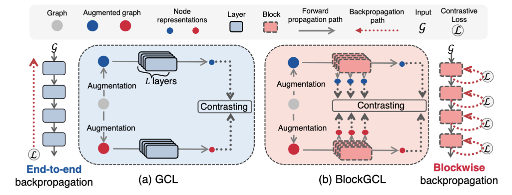

## BlockGCL  (Under review)
This is a PyTorch implementation of BlockGCL from the paper "Scaling Up, Scaling Deep: Blockwise Graph Contrastive Learning".

<div align="center">
  
</div>

## Requirements
- numpy==1.21.5
- torch==1.12.0
- torch-cluster==1.6.0
- torch_geometric==2.1.0.post1
- torch-scatter==2.0.9
- torch-sparse==0.6.15
- CUDA 11.6

## Reproduction
To reproduce our results, please run:
```shell
bash run.sh
```

Due to the absence of predefined partitions for the Photo, Computer, CS, and Physics datasets, you should create a folder named "mask" in the current directory to store the random partitions.